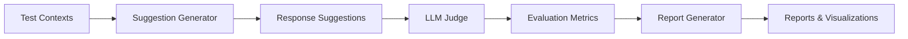

# LLM Judge Evaluation System

A comprehensive evaluation framework for comparing LLM performance in generating chat response suggestions. This system uses the "LLM-as-Judge" approach to provide scalable, consistent evaluation of response quality.

## 🚀 Quick Start

```bash
# Install dependencies
pip install -r requirements.txt

# Set API keys
export OPENAI_API_KEY='your-openai-api-key'
export ANTHROPIC_API_KEY='your-anthropic-api-key'

# Run evaluation
python llm_judge_system.py
```

## 📋 Requirements

```txt
pandas>=2.0.0
numpy>=1.24.0
matplotlib>=3.7.0
seaborn>=0.12.0
plotly>=5.14.0
aiohttp>=3.8.0
scipy>=1.10.0
python-dotenv>=1.0.0
kaleido>=0.2.1  # For plotly image export
```

## 🏗️ System Architecture

### Core Components

1. **LLM Providers** - Abstraction layer for different LLM APIs
2. **Suggestion Generator** - Generates response suggestions using LLMs
3. **LLM Judge** - Evaluates suggestion quality using structured prompts
4. **Evaluation Pipeline** - Orchestrates the evaluation process
5. **Report Generator** - Creates comprehensive reports and visualizations

### Evaluation Flow



## 📊 Metrics Evaluated

### Per-Suggestion Metrics (0-10 scale)
- **Relevance**: How well the suggestion fits the conversation context
- **Sentiment Alignment**: Match with conversation emotional tone
- **Naturalness**: Human-like quality of the response
- **Helpfulness**: Value in moving conversation forward
- **Safety**: Pass/Fail for inappropriate content

### Overall Metrics
- **Diversity Score**: How different the three suggestions are
- **Best Suggestion**: Which position (1, 2, or 3) is best
- **Overall Quality**: Aggregate quality score
- **Generation Time**: Speed of response generation
- **Evaluation Time**: Speed of quality assessment

## 🔧 Configuration

### Basic Configuration

```python
from llm_judge_system import run_evaluation

run_evaluation(
    num_contexts=20,  # Number of test scenarios
    models_to_test={
        "gpt-4": "gpt-4-turbo-preview",
        "gpt-3.5": "gpt-3.5-turbo",
        "claude-opus": "claude-3-opus-20240229"
    },
    judge_model="gpt-4-turbo-preview"
)
```

### Advanced Configuration

```python
from llm_judge_examples import CustomEvaluationConfig

config = CustomEvaluationConfig()
config.config['models']['openai']['gpt-4']['temperature'] = 0.8
config.config['evaluation']['batch_size'] = 10

providers = config.get_providers()
```

## 📁 Output Structure

```
evaluation_reports/
└── llm_evaluation_report_YYYYMMDD_HHMMSS/
    ├── raw_results.csv              # Complete evaluation data
    ├── summary_statistics.csv       # Aggregated metrics by model
    ├── evaluation_report.md         # Executive summary
    ├── model_comparison_radar.html  # Interactive radar chart
    ├── model_comparison_radar.png   # Static radar chart
    ├── metric_distributions.html    # Score distribution plots
    ├── metric_distributions.png     
    ├── performance_heatmap.png      # Model comparison heatmap
    ├── safety_analysis.html         # Safety pass rates
    ├── safety_analysis.png
    ├── time_analysis.html           # Performance timing
    ├── time_analysis.png
    └── best_suggestion_analysis.html # Position analysis
```

## 📝 Custom Test Data

### JSON Format

```json
[
  {
    "chat_history": [
      {"role": "user", "content": "I need help with my order"},
      {"role": "assistant", "content": "I'd be happy to help! What's your order number?"}
    ],
    "current_message": "It's order #12345 and it hasn't arrived",
    "sentiment": "frustrated",
    "emotional_indicators": ["urgency", "disappointment"],
    "rag_context": "Customer is premium member, order shows delayed status"
  }
]
```

### Loading Custom Data

```python
from llm_judge_examples import TestDataLoader

# Load from JSON
contexts = TestDataLoader.load_from_json('test_data.json')

# Load from CSV
contexts = TestDataLoader.load_from_csv('test_data.csv')

# Run evaluation with custom data
run_evaluation(test_contexts=contexts)
```

## 📈 Analyzing Results

### Basic Analysis

```python
import pandas as pd
from llm_judge_examples import ResultAnalyzer

# Load results
results_df = pd.read_csv('evaluation_reports/latest/raw_results.csv')
analyzer = ResultAnalyzer(results_df)

# Get model strengths/weaknesses
analysis = analyzer.get_model_strengths_weaknesses('gpt-4')
print(f"Strengths: {analysis['strengths']}")
print(f"Weaknesses: {analysis['weaknesses']}")

# Find failure cases
failures = analyzer.find_failure_cases(threshold=5.0)
print(f"Found {len(failures)} failure cases")

# Statistical comparison
comparison = analyzer.compare_models_statistical('gpt-4', 'gpt-3.5')
print(f"GPT-4 vs GPT-3.5 overall quality p-value: {comparison['overall_quality']['p_value']}")
```

### Continuous Monitoring

```python
from llm_judge_examples import ContinuousEvaluator, CustomEvaluationConfig

config = CustomEvaluationConfig()
evaluator = ContinuousEvaluator(config)

# Run evaluation every 24 hours
import asyncio
asyncio.run(evaluator.run_periodic_evaluation(
    test_contexts=contexts,
    interval_hours=24
))
```

## 🎯 Best Practices

### 1. Test Data Design
- Include diverse conversation scenarios
- Cover different sentiments and emotional states
- Add edge cases (angry customers, technical queries, etc.)
- Include RAG context when relevant
- Aim for 50-100 test contexts for reliable results

### 2. Model Selection
- Use your most capable model as the judge (e.g., GPT-4)
- Test all models you're considering for production
- Include both quality-focused and speed-focused models
- Consider cost implications in your analysis

### 3. Evaluation Frequency
- Run initial comprehensive evaluation (100+ contexts)
- Set up weekly/monthly re-evaluation for monitoring
- Run immediate evaluation when changing prompts
- Use smaller test sets (20-30) for quick iterations

### 4. Result Interpretation
- Look for consistent patterns across metrics
- Consider both quality AND speed metrics
- Check safety pass rates carefully
- Analyze failure cases to understand model limitations
- Use statistical tests for significant differences

## 🔍 Troubleshooting

### Common Issues

1. **API Rate Limits**
   ```python
   # Add delays between API calls
   import time
   time.sleep(1)  # Add to evaluation loop
   ```

2. **JSON Parsing Errors**
   - Check judge model temperature (should be 0)
   - Verify prompt format hasn't changed
   - Add retry logic for failed evaluations

3. **Memory Issues with Large Evaluations**
   - Use batch processing
   - Enable intermediate result saving
   - Process results in chunks

### Debug Mode

```python
import logging
logging.basicConfig(level=logging.DEBUG)

# This will show detailed API calls and parsing steps
```

## 📚 Advanced Usage

### Custom Metrics

```python
# Extend the EvaluationMetrics class
from dataclasses import dataclass

@dataclass
class CustomEvaluationMetrics(EvaluationMetrics):
    brand_consistency: float
    technical_accuracy: float
```

### Custom Judge Prompts

```python
# Modify the judge prompt for specific use cases
judge = LLMJudge(provider)
judge.judge_prompt_template = """
Your custom evaluation prompt here...
Include specific criteria for your use case.
"""
```

### Integration with CI/CD

```yaml
# .github/workflows/llm-evaluation.yml
name: LLM Evaluation
on:
  schedule:
    - cron: '0 0 * * 0'  # Weekly
jobs:
  evaluate:
    runs-on: ubuntu-latest
    steps:
      - uses: actions/checkout@v2
      - name: Run LLM Evaluation
        env:
          OPENAI_API_KEY: ${{ secrets.OPENAI_API_KEY }}
        run: python llm_judge_system.py
      - name: Upload Results
        uses: actions/upload-artifact@v2
        with:
          name: evaluation-results
          path: evaluation_reports/
```

## 🤝 Contributing

1. Fork the repository
2. Create a feature branch (`git checkout -b feature/amazing-feature`)
3. Commit your changes (`git commit -m 'Add amazing feature'`)
4. Push to the branch (`git push origin feature/amazing-feature`)
5. Open a Pull Request

## 📄 License

This project is licensed under the MIT License - see the LICENSE file for details.

## 🙏 Acknowledgments

- Inspired by the "LLM-as-Judge" paper and methodology
- Built for production use in chat applications
- Designed for easy extensibility and customization

## 📞 Support

For questions or support:
- Open an issue on GitHub
- Check the troubleshooting section
- Review the examples in `llm_judge_examples.py`

---

**Remember**: The quality of your evaluation is only as good as your test data and judge model. Invest time in creating comprehensive test scenarios that reflect real-world usage!